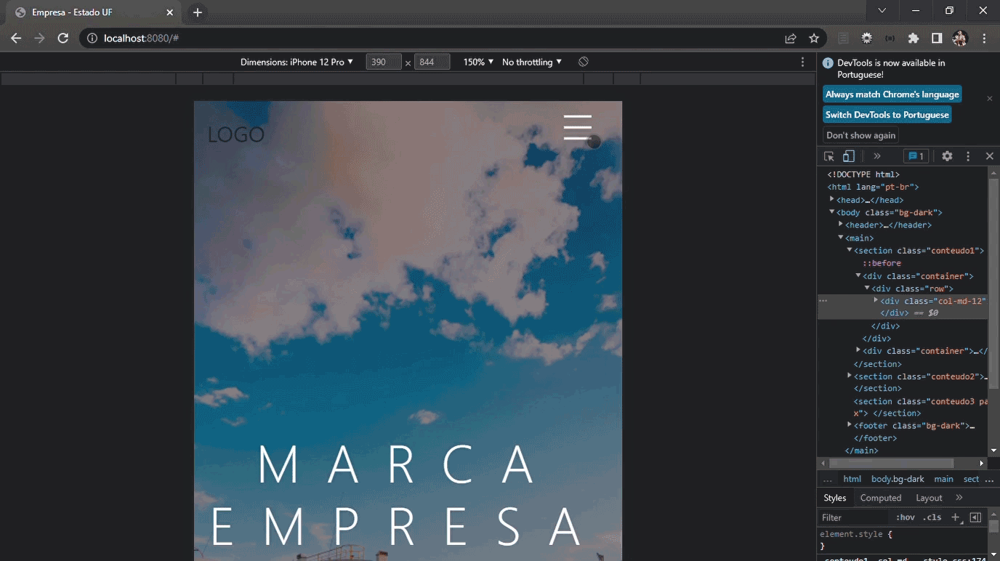

# Web Template - Node.js


Visual Web


---

Visual Mobile



</br>

## 🔖Sobre
</br>
Web Template com efeito parallax, menu interativo com alterção de ícone em visualização mobile.
A aplicação possui efeito "back to top".
</br>
</br>

---

## 💻Teconologias Utilizadas

- HTML
- CSS
- Bootstrap
- Animate.css
- JavaScript
- ES6
- Node.js
- EJS

---

## 🔁Rotas

</br>

| Métodos  | Endereço  | Retorno |
| ------------ |---------------|-----|
| `GET`      | /        | Index  |

</br>

---

## 💾Instalação

**1. Instalar dependencias:**

```shell
$ npm install
```

Listen in: 

```
http://localhost:8080/
```

---

Desenvolvido por Márkys Corrêa.